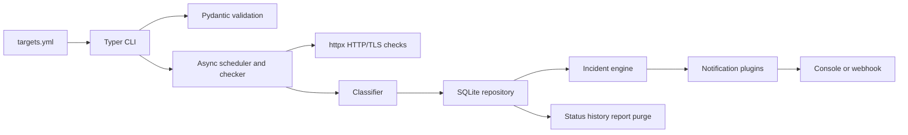

# PulseCheck uptime and SSL monitor

A Python CLI project that checks websites, detects incidents, warns about SSL expiry, and reports uptime evidence.

## Quick facts

| Item | Value |
|---|---|
| Track | Python Core with SRE and production-support flavour |
| Difficulty | ★★★☆☆ Intermediate |
| Duration | 6 weeks, about 180 hours |
| Target job roles | Python Developer, Automation Engineer, Junior SRE, Production Support Engineer |
| Key skills | Python packaging, Typer, asyncio, httpx, Pydantic, SQLite, TLS, pytest, mypy, GitHub Actions |
| Prerequisites | Basic Python, basic SQL, Git basics, and terminal basics |
| Minimum hardware | 8 GB RAM laptop in the Lite profile |
| Student repository name | `pulsecheck` |

## What you will build

- An installable CLI package with the console command `pulsecheck`.
- A YAML targets file with strict validation and clear error messages.
- Concurrent HTTP and HTTPS checks with timeouts, retries, and jitter.
- Exact result states: `UP`, `DEGRADED`, `DOWN`, and display-only `UNKNOWN`.
- A scheduler that respects each target interval and shuts down safely.
- SQLite storage for final check results, incidents, SSL observations, and notifications.
- Incident rules that open after 3 consecutive `DOWN` results and close after 2 non-`DOWN` results.
- SSL expiry and hostname checks with 30, 14, and 7 day warnings.
- Console and webhook notifications with de-duplication and cooldown.
- Uptime, p95 latency, missed check, incident, and MTTR reports.

## Architecture at a glance

## How to read this specification

Start with documents 01, 02, 03, and 04. Then read the architecture, data model, CLI specification, and testing strategy. Use documents 06, 10, 11, 12, 13, and 14 during implementation and review.

RFC 2119 keywords have fixed meanings. **MUST** is mandatory. **SHOULD** is recommended after Must work is stable. **MAY** is optional stretch work.

IDs show traceability. User stories use `US-NN`. Functional requirements use `FR-AREA-NN`. Business rules use `BR-NN`. Non-functional requirements use `NFR-CAT-NN`. Test cases use `TC-TYPE-NNN`.

## Document index

| Document | Purpose |
|---|---|
| [01 Project overview](docs/01-project-overview.md) | Problem, vision, scope, constraints, and success criteria. |
| [02 Users and roles](docs/02-users-and-roles.md) | Personas, permissions, journeys, and user stories. |
| [03 Functional requirements](docs/03-functional-requirements.md) | Must, Should, Could requirements and business rules. |
| [04 Non-functional requirements](docs/04-non-functional-requirements.md) | Performance, reliability, security, maintainability, portability, and hardware targets. |
| [05 System architecture](docs/05-system-architecture.md) | Architecture diagrams, flows, deployment view, repository tree, and ADR list. |
| [06 Tech stack and setup](docs/06-tech-stack-and-setup.md) | Tool versions, alternatives, setup steps, hardware profiles, and learning order. |
| [07 Data model](docs/07-data-model.md) | Targets-file model, SQLite tables, constraints, indexes, retention, and migrations. |
| [08 CLI specification](docs/08-cli-specification.md) | Commands, options, output formats, exit codes, and examples. |
| [09 Testing strategy and test cases](docs/09-testing-strategy-and-test-cases.md) | Test strategy, coverage gates, test catalog, and traceability matrix. |
| [10 DevOps, CI/CD, and quality](docs/10-devops-ci-cd-and-quality.md) | Git workflow, CI gates, Docker, secrets, releases, and Definition of Done. |
| [11 Milestones and deliverables](docs/11-milestones-and-deliverables.md) | Effort budget, 6-week plan, Gantt chart, submission, and demo script. |
| [12 Evaluation rubric](docs/12-evaluation-rubric.md) | Mandatory gates, scoring, bonus, deductions, grade bands, and viva questions. |
| [13 Interview preparation](docs/13-interview-preparation.md) | STAR pitch, interview questions, fundamentals, resume bullets, and profile tips. |
| [14 Glossary and resources](docs/14-glossary-and-resources.md) | Glossary, verified official links, free resources, and reading order. |

## Rules for students

### Individual work

You build the implementation alone in your own public repository. You may discuss concepts with classmates, but you must write and explain your own code.

### AI assistant policy

> You MAY use AI assistants (for example GitHub Copilot or ChatGPT) to learn concepts, explain errors, and review your code. You MUST understand every line that you commit. You MUST tell the trainer about significant AI help in the pull request description. You MUST NOT give this specification to an AI tool and submit the generated solution as your own work. In the viva, the trainer asks you to explain and change your code live. If you cannot explain your code, the result is "Rework required".

### How to ask questions

> Open a GitHub Issue in this specification repository. Start the title with `[Question]`. The trainer answers in the issue, so all students can see the answer. If the answer changes the specification, the trainer updates the change log.

### Student repository

> Create a public repository with the name `pulsecheck` in your own GitHub account. Add the trainer (`@sukurcf`) as a collaborator. Do not copy this specification into your repository. Link to it from your README.

### Review model

> Every change goes through a pull request. You MAY merge your own pull request after CI is green and you complete the PR checklist. The trainer reviews at least 2 substantive pull requests from each student every week. The trainer can ask for changes at any time.

### Requirement freeze

> This specification is frozen for the cohort. The trainer can add clarifications. If a change affects grading, the change log states the impact.

### Weekly demo

Every Friday, show a 15-minute demo to the trainer. Show working software, not slides. Explain which FR, BR, NFR, or test IDs you completed that week.

## Change log

| Version | Date | Notes |
|---|---|---|
| 1.0 | 2026-10-02 | First release |
