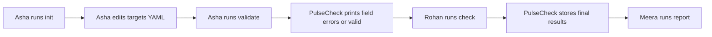
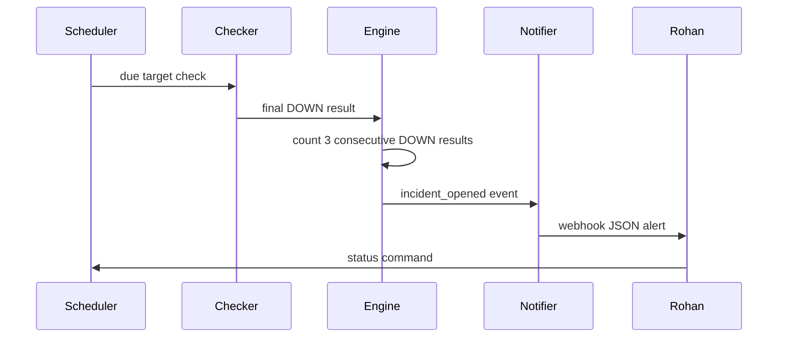
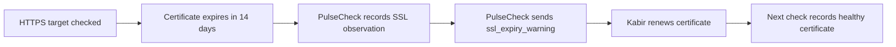

# PulseCheck users and roles

Purpose: This document defines PulseCheck users, personas, permissions, journeys, and user stories.

## Roles

| Role | Description | Main need |
|---|---|---|
| Developer | Creates and maintains the `pulsecheck` implementation. | Safe configuration, tests, packaging, and storage. |
| Site owner | Owns one or more monitored websites or APIs. | Simple service state and early SSL warnings. |
| On-call engineer | Responds to incidents and alerts. | Fast status, useful history, and non-noisy notifications. |
| Team lead | Reviews weekly service availability. | Reports with uptime, incidents, and MTTR. |
| System actor | Runs PulseCheck from cron, CI, or a service manager. | Stable exit codes, logs, and non-interactive output. |

## Personas

| Persona | Role | Goals | Pain points | Technical comfort |
|---|---|---|---|---|
| Asha Nair | Developer | Keep targets valid and ship a tested CLI. | YAML mistakes can cause wrong checks. | Medium |
| Rohan Patil | On-call engineer | Know if the fee portal is down before users call. | Duplicate alerts waste time during long incidents. | Medium |
| Meera Iyer | Team lead | Read weekly uptime and MTTR in a short report. | Manual incident notes are incomplete. | Low |
| Kabir Khan | Site owner | Renew certificates before browser warnings appear. | He does not know TLS commands. | Low |

## Permission matrix

| Action | Developer | Site owner | On-call engineer | Team lead | System actor |
|---|---|---|---|---|---|
| Edit the targets file | Yes | Yes | No | No | No |
| Run `init` | Yes | Yes | No | No | No |
| Run `validate` | Yes | Yes | Yes | No | Yes |
| Run `check` | Yes | Yes | Yes | No | Yes |
| Run `run` scheduler | Yes | No | Yes | No | Yes |
| Run `status` | Yes | Yes | Yes | Yes | Yes |
| Run `history` | Yes | Yes | Yes | Yes | Yes |
| Run `report` | Yes | No | Yes | Yes | Yes |
| Run `purge` | Yes | No | No | No | No |
| Configure notifiers | Yes | No | Yes | No | No |
| Read SQLite database directly | Yes | No | No | No | No |

## User journey: first monitored target

## User journey: incident response

## User journey: SSL renewal

## User stories

| ID | Story | Priority | Linked FR IDs |
|---|---|---|---|
| US-01 | As a developer, I want one targets file, so that monitored services are easy to review. | Must | FR-CFG-01, FR-CFG-02, FR-CLI-01 |
| US-02 | As a developer, I want strict validation, so that a bad keyword and `HEAD` combination fails before checks start. | Must | FR-CFG-02, FR-CLI-02 |
| US-03 | As an on-call engineer, I want a one-off check command, so that I can verify all targets or one tag. | Must | FR-CLI-03, FR-CHECK-01, FR-CHECK-02 |
| US-04 | As a system actor, I want stable result classification, so that cron and CI can act on failures. | Must | FR-CHECK-03, FR-CLI-08 |
| US-05 | As an on-call engineer, I want a scheduler, so that checks run at each target interval. | Must | FR-CLI-04, FR-SCHED-01, FR-SCHED-02 |
| US-06 | As a developer, I want SQLite storage and purge, so that monitoring evidence survives restarts but stays bounded. | Must | FR-STORE-01, FR-STORE-02 |
| US-07 | As an on-call engineer, I want incidents opened and closed by exact consecutive-result rules, so that alerts are not sent for one bad sample. | Must | FR-INC-01, FR-INC-02 |
| US-08 | As a site owner, I want SSL expiry and hostname checks, so that certificates are renewed before users see warnings. | Must | FR-SSL-01, FR-SSL-02 |
| US-09 | As an on-call engineer, I want console and webhook notifications with cooldown, so that alert noise is controlled. | Must | FR-NOTIF-01, FR-NOTIF-02 |
| US-10 | As a team lead, I want status, history, and reports, so that I can discuss uptime with evidence. | Must | FR-CLI-05, FR-CLI-06, FR-CLI-07, FR-REPORT-01, FR-REPORT-02, FR-REPORT-03 |
| US-11 | As a developer, I want logging controls and package installation, so that the tool is usable in a terminal and automation. | Must | FR-OBS-01, FR-PKG-01 |
| US-12 | As an on-call engineer, I want SMTP alerts and maintenance windows, so that planned work does not create noisy alerts. | Should | FR-NOTIF-03, FR-SCHED-03 |
| US-13 | As a team lead, I want CSV and HTML reports, so that reports can be shared without running the CLI. | Should | FR-REPORT-04, FR-REPORT-05 |
| US-14 | As a junior SRE, I want optional metrics and extra check types, so that I can extend PulseCheck after the MVP. | Could | FR-MET-01, FR-CHECK-04 |

## Story coverage of Must FRs

US-01 through US-11 cover every Must FR. Each linked Must FR MUST have at least one test case in `09-testing-strategy-and-test-cases.md`. Should stories do not block the final grade. Could stories are the only stories that can earn bonus points.

[Back to README](../README.md)
