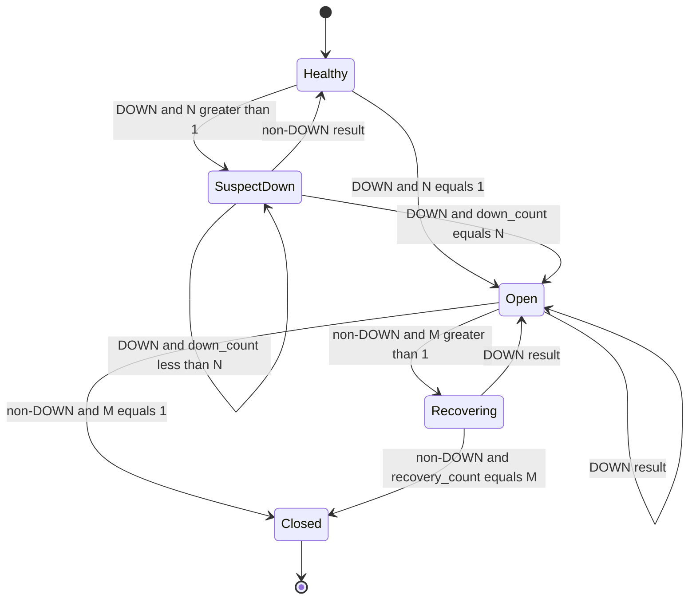

# PulseCheck functional requirements

Purpose: This document defines PulseCheck functional requirements, business rules, state machines, validation rules, and error scenarios.

## Requirement summary

| ID | Title | Priority | Roles | Linked BRs |
|---|---|---|---|---|
| FR-CFG-01 | Targets file schema | Must | Developer, Site owner | BR-01, BR-02, BR-03 |
| FR-CFG-02 | Configuration validation | Must | Developer, System actor | BR-02, BR-03 |
| FR-CLI-01 | `init` sample file | Must | Developer, Site owner | BR-01 |
| FR-CLI-02 | `validate` command | Must | Developer, System actor | BR-02, BR-03 |
| FR-CLI-03 | `check` command | Must | On-call engineer, System actor | BR-04, BR-05, BR-06 |
| FR-CLI-04 | `run` scheduler command | Must | On-call engineer, System actor | BR-07, BR-08 |
| FR-CLI-05 | `status` command | Must | On-call engineer, Team lead | BR-04 |
| FR-CLI-06 | `history` command | Must | Team lead, System actor | BR-16 |
| FR-CLI-07 | `report` command | Must | Team lead, System actor | BR-09, BR-10, BR-11 |
| FR-CLI-08 | Exit codes | Must | System actor | BR-17 |
| FR-CHECK-01 | Async HTTP checks | Must | System actor | BR-04, BR-05 |
| FR-CHECK-02 | Retry policy | Must | System actor | BR-05 |
| FR-CHECK-03 | Result classification | Must | On-call engineer, System actor | BR-04 |
| FR-SCHED-01 | Per-target scheduling | Must | On-call engineer, System actor | BR-07, BR-08 |
| FR-SCHED-02 | Graceful scheduler shutdown | Must | On-call engineer, System actor | BR-08, BR-17 |
| FR-STORE-01 | SQLite repository storage | Must | Developer | BR-12 |
| FR-STORE-02 | Retention purge | Must | Developer | BR-16 |
| FR-INC-01 | Incident state machine | Must | On-call engineer | BR-07, BR-08 |
| FR-INC-02 | MTTR calculation | Must | Team lead | BR-11 |
| FR-SSL-01 | SSL certificate checks | Must | Site owner | BR-13 |
| FR-SSL-02 | SSL expiry warnings | Must | Site owner, On-call engineer | BR-14, BR-15 |
| FR-NOTIF-01 | Notification plugins | Must | On-call engineer | BR-15 |
| FR-NOTIF-02 | Notification de-duplication | Must | On-call engineer | BR-15 |
| FR-OBS-01 | Logging controls | Must | Developer, System actor | BR-18 |
| FR-PKG-01 | Installable package | Must | Developer | BR-19 |
| FR-REPORT-01 | Human table output | Must | On-call engineer, Team lead | BR-20 |
| FR-REPORT-02 | Uptime report metrics | Must | Team lead | BR-09, BR-10, BR-11 |
| FR-REPORT-03 | Missed check reporting | Must | Team lead | BR-09 |
| FR-NOTIF-03 | SMTP notifier | Should | On-call engineer | BR-15 |
| FR-REPORT-04 | CSV output | Should | Team lead | BR-20 |
| FR-REPORT-05 | HTML status page | Should | Team lead | BR-20 |
| FR-SSL-03 | SSL issuer and subject | Should | Site owner | BR-13 |
| FR-OPS-01 | Docker run image | Should | Developer | BR-21 |
| FR-SCHED-03 | Maintenance windows | Should | On-call engineer | BR-15 |
| FR-DOC-01 | Documentation site | Should | Developer | BR-19 |
| FR-UI-01 | Terminal dashboard | Could | On-call engineer | BR-04 |
| FR-MET-01 | Prometheus metrics | Could | Junior SRE | BR-09 |
| FR-CHECK-04 | TCP and DNS checks | Could | Junior SRE | BR-04 |
| FR-NOTIF-04 | Telegram notifier | Could | On-call engineer | BR-15 |
| FR-TEST-01 | Mutation testing | Could | Developer | BR-19 |

## Must requirements

### FR-CFG-01 — Targets file schema

Priority: Must. Roles: Developer, Site owner. Linked rules: BR-01, BR-02, BR-03.

PulseCheck MUST read a YAML targets file that contains a `global` object and a `targets` list. Each target MUST define `name` and `url`. Optional target fields are `method`, `expected_status_codes`, `keyword`, `timeout_seconds`, `interval_seconds`, `latency_threshold_ms`, `tags`, and `headers`.

Acceptance criteria:
- Given a targets file with `global.concurrency: 50` and one target named `college-home`, when Asha runs `pulsecheck validate --config targets.yml`, then the command exits 0 and prints `Configuration valid: 1 target`.
- Given a target omits `method` and `expected_status_codes`, when PulseCheck loads it, then the target uses `GET` and `[200]`.
- Given a target with no `timeout_seconds`, when PulseCheck loads it, then the target uses `global.timeout_seconds` or the built-in default `5.0` seconds.
- Given a target with `method: HEAD` and `keyword: Welcome`, when PulseCheck validates the file, then it exits 2 and reports path `targets[0].keyword` with reason `keyword is not allowed when method is HEAD`.

### FR-CFG-02 — Configuration validation

Priority: Must. Roles: Developer, System actor. Linked rules: BR-02, BR-03.

PulseCheck MUST validate all fields before it starts a check or scheduler run. It MUST report every validation error that can be found in one pass. Each error MUST include `path`, `code`, and `reason`.

Acceptance criteria:
- Given `targets[0].url: ftp://example.in`, when Asha runs `pulsecheck validate`, then the command exits 2 and prints `targets[0].url | invalid_url_scheme | must start with http:// or https://`.
- Given duplicate target names `college-home`, when validation runs, then it exits 2 and reports `targets[1].name | duplicate_target_name | must be unique`.
- Given `global.concurrency: 0` and `targets[0].interval_seconds: 5`, when validation runs, then both errors appear in the same response.

### FR-CLI-01 — `init` sample file

Priority: Must. Roles: Developer, Site owner. Linked rules: BR-01.

The `init` command MUST write a sample targets file. The command MUST refuse to overwrite an existing file unless the user passes `--force`. The sample MUST use only `example.in` hostnames and safe placeholder webhook values.

Acceptance criteria:
- Given no `targets.yml` file exists, when Asha runs `pulsecheck init --output targets.yml`, then PulseCheck writes the file and exits 0.
- Given `targets.yml` already exists, when Asha runs the same command without `--force`, then it exits 2 and prints `targets.yml already exists; use --force to overwrite`.

### FR-CLI-02 — `validate` command

Priority: Must. Roles: Developer, System actor. Linked rules: BR-02, BR-03.

The `validate` command MUST parse and validate the targets file without running network checks. It MUST support `--config <path>`. It MUST be safe for CI because it returns exit code 2 for configuration errors.

Acceptance criteria:
- Given a valid file with 3 targets, when CI runs `pulsecheck validate --config targets.yml`, then the command exits 0 and prints `Configuration valid: 3 targets`.
- Given malformed YAML, when validation runs, then it exits 2 and reports `file | yaml_parse_error | could not parse targets file`.

### FR-CLI-03 — `check` command

Priority: Must. Roles: On-call engineer, System actor. Linked rules: BR-04, BR-05, BR-06.

The `check` command MUST perform one concurrent check for each selected target. It MUST support checking all targets or only targets that have a supplied `--tag`. It MUST store only the final result after retries.

Acceptance criteria:
- Given targets tagged `public` and `internal`, when Rohan runs `pulsecheck check --tag public`, then only targets with tag `public` are checked and stored.
- Given one target returns HTTP 503 after all attempts, when `check` completes, then the table shows status `DOWN`, attempt count `global.retries + 1`, and exit code 1.
- Given no target has tag `payments`, when `pulsecheck check --tag payments` runs, then it exits 2 and prints `No targets matched tag payments`.

### FR-CLI-04 — `run` scheduler command

Priority: Must. Roles: On-call engineer, System actor. Linked rules: BR-07, BR-08.

The `run` command MUST continuously schedule checks based on each target's `interval_seconds`. It MUST support graceful shutdown on Ctrl+C and SIGTERM. It MUST not start a second concurrent check for the same target when a previous run is still in progress.

Acceptance criteria:
- Given target A has `interval_seconds: 60` and target B has `interval_seconds: 300`, when the scheduler runs for 10 minutes, then A is due about 10 times and B is due about 2 times.
- Given Ctrl+C arrives while 4 checks are in flight and all latest selected target states are `UP`, when shutdown starts, then PulseCheck waits up to 5 seconds, stores completed final outcomes, and exits 0.
- Given SIGTERM arrives after one selected target is `DEGRADED`, when shutdown finishes, then PulseCheck exits 1.
- Given a target check takes longer than its interval, when the next tick occurs, then the scheduler records one missed check and does not overlap the target.

### FR-CLI-05 — `status` command

Priority: Must. Roles: On-call engineer, Team lead. Linked rules: BR-04.

The `status` command MUST show the latest stored state for each configured target. It MUST show target name, URL, status, checked time, latency, open incident ID when present, and SSL days to expiry when known. It MUST not run new network checks.

Acceptance criteria:
- Given `college-home` has latest result `UP`, when Meera runs `pulsecheck status`, then the table includes `college-home`, `UP`, the UTC checked time, and no open incident ID.
- Given the database has no result for `new-api`, when status runs, then the row shows `UNKNOWN` and exit code 1.

### FR-CLI-06 — `history` command

Priority: Must. Roles: Team lead, System actor. Linked rules: BR-16.

The `history` command MUST list stored check results. It MUST support filters `--target`, `--since`, `--until`, and `--limit`. It MUST support `--format table` and `--format json`.

Acceptance criteria:
- Given 20 stored results for `fee-portal`, when Meera runs `pulsecheck history --target fee-portal --limit 5`, then exactly 5 newest matching rows are printed.
- Given `--since 2026-10-02T00:00:00+05:30`, when history runs, then PulseCheck converts the bound to UTC before filtering.
- Given `--limit 0`, when history runs, then it exits 2 and reports `limit | invalid_range | must be between 1 and 1000`.

### FR-CLI-07 — `report` command

Priority: Must. Roles: Team lead, System actor. Linked rules: BR-09, BR-10, BR-11.

The `report` command MUST compute uptime %, average latency, p95 latency, incident count, missed check count, and MTTR for a period. It MUST support Markdown and JSON output. It MUST include the report period and time zone.

Acceptance criteria:
- Given 100 completed checks with 4 `DOWN` and 6 `DEGRADED`, when report runs, then uptime is `96.00%` because degraded checks count as available.
- Given report output format `json`, when p95 latency is calculated from five completed checks, then the JSON field `p95_latency_ms` contains the nearest-rank value.
- Given 3 missed scheduler checks in the period, when report runs, then it prints `Missed checks: 3` and excludes them from the uptime denominator.

### FR-CLI-08 — Exit codes

Priority: Must. Roles: System actor. Linked rules: BR-17.

Every command MUST use the documented exit codes. For `check`, `status`, and `run`, exit code 0 means all evaluated targets are `UP`. For `init`, `validate`, `history`, `report`, and `purge`, exit code 0 means the command succeeded. Exit code 1 applies only to `check`, `status`, and `run` when at least one selected target is `DOWN`, `DEGRADED`, or `UNKNOWN`. Exit code 2 means configuration or usage error. Exit code 3 means internal error.

Acceptance criteria:
- Given all checked targets are `UP`, when `pulsecheck check` finishes, then the process exits 0.
- Given one target is `DEGRADED`, when `pulsecheck check` finishes, then the process exits 1.
- Given `pulsecheck report` succeeds while the period contains `DOWN` rows, when the report is written, then the process exits 0.
- Given SQLite migration fails, when any storage command starts, then it exits 3 and prints `Internal error: database migration failed`.

### FR-CHECK-01 — Async HTTP checks

Priority: Must. Roles: System actor. Linked rules: BR-04, BR-05.

The checker MUST use asyncio and httpx. It MUST enforce `global.concurrency` with default 10 and maximum 200. It MUST apply each target timeout to each attempt.

Acceptance criteria:
- Given 200 local targets, `global.concurrency: 50`, and 100 ms response delay, when `check` runs on reference hardware, then it completes in under 10 seconds.
- Given `global.concurrency: 2` and 5 targets, when checks run, then at most 2 network attempts are active at one time.
- Given a target timeout of `0.5` seconds and a server delay of 2 seconds, when checking, then the final classification is `DOWN` with error kind `timeout`.

### FR-CHECK-02 — Retry policy

Priority: Must. Roles: System actor. Linked rules: BR-05.

Retries MUST happen inside one check. Only the final outcome is stored. Backoff MUST start at 0.25 seconds, double each time, cap at 2 seconds, and add jitter from 0 to 250 ms.

Acceptance criteria:
- Given `global.retries: 2` and two connection failures followed by HTTP 200, when a check runs, then one stored result has `attempt_count: 3` and status `UP`.
- Given all 3 attempts time out, when the check finishes, then one stored result has `attempt_count: 3` and status `DOWN`.
- Given `global.retries: -1`, when validation runs, then it exits 2 with `global.retries | invalid_range | must be between 0 and 5`.

### FR-CHECK-03 — Result classification

Priority: Must. Roles: On-call engineer, System actor. Linked rules: BR-04.

PulseCheck MUST classify final results using exact rules. `DOWN` means connection error, DNS error, TLS error, timeout, unexpected status code, or required keyword missing. `DEGRADED` means the final response is otherwise successful but latency is above `latency_threshold_ms`. `UP` means all other successful checks.

Acceptance criteria:
- Given expected status codes `[200, 204]` and actual status `500`, when classification runs, then result is `DOWN` with error kind `status`.
- Given keyword `Welcome` and response body without that text, when classification runs, then result is `DOWN` with error kind `keyword`.
- Given HTTP 200 with latency `1600 ms` and threshold `1500 ms`, when classification runs, then result is `DEGRADED`.
- Given HTTP 204, no keyword, and latency `100 ms`, when classification runs, then result is `UP`.

### FR-SCHED-01 — Per-target scheduling

Priority: Must. Roles: On-call engineer, System actor. Linked rules: BR-07, BR-08.

The scheduler MUST respect each target's effective `interval_seconds` value. It MUST calculate due checks per target and avoid shared global polling intervals. It MUST record a missed check when a target is due but still running.

Acceptance criteria:
- Given `college-home` has interval 60 seconds and `fee-portal` has interval 300 seconds, when `run` executes for 10 minutes, then `college-home` is scheduled about 10 times and `fee-portal` about 2 times.
- Given a target is still checking at its next due time, when the scheduler tick arrives, then PulseCheck records one missed check and does not start an overlapping check.
- Given the targets file changes on disk while `run` is active, when no reload option is documented, then the active process keeps the configuration loaded at startup.

### FR-SCHED-02 — Graceful scheduler shutdown

Priority: Must. Roles: On-call engineer, System actor. Linked rules: BR-08, BR-17.

The `run` command MUST handle Ctrl+C and SIGTERM safely. It MUST stop accepting new due checks, wait up to 5 seconds for in-flight checks, store completed final outcomes, and then exit. After a normal shutdown signal, exit code 0 means every selected target's latest state is `UP`; exit code 1 means any selected target is `DOWN`, `DEGRADED`, or `UNKNOWN`.

Acceptance criteria:
- Given 4 checks are in flight and every selected target's latest state is `UP`, when Ctrl+C arrives, then PulseCheck waits up to 5 seconds, prints `Shutdown requested; stored completed checks`, and exits 0.
- Given SIGTERM arrives while no checks are active and every selected target's latest state is `UP`, when shutdown runs, then the process exits 0 within 5 seconds.
- Given Ctrl+C arrives after one selected target's latest state is `DEGRADED`, when shutdown runs, then the process exits 1.
- Given a check does not finish during the 5 second shutdown window, when the process exits, then no partial check result is stored for that unfinished attempt.

### FR-STORE-01 — SQLite repository storage

Priority: Must. Roles: Developer. Linked rules: BR-12.

PulseCheck MUST store final check results, incidents, notifications, SSL certificate observations, and schema version in SQLite. It MUST access the database through a repository layer. It MUST use transactions for writes that change related rows.

Acceptance criteria:
- Given one final check result, when storage succeeds, then one row is created in `check_results` and no attempt rows are stored.
- Given an incident opens from a check result, when the repository writes data, then `check_results` and `incidents` changes are committed in one transaction.
- Given the database schema version is older than supported migrations, when startup runs, then migrations run before commands read data.

### FR-STORE-02 — Retention purge

Priority: Must. Roles: Developer. Linked rules: BR-16.

The `purge --older-than <days>` command MUST delete old check results, old missed checks, and old SSL observations. It MUST NOT delete open incidents. It MUST report the number of rows removed per table.

Acceptance criteria:
- Given check results and missed checks older than 90 days, when Asha runs `pulsecheck purge --older-than 90`, then those rows are deleted and the output includes counts for `check_results` and `missed_checks`.
- Given an open incident started 100 days ago, when purge runs, then the incident row remains.
- Given `--older-than 0`, when purge runs, then it exits 2 and reports `older_than | invalid_range | must be at least 1 day`.

### FR-INC-01 — Incident state machine

Priority: Must. Roles: On-call engineer. Linked rules: BR-07, BR-08.

The incident engine MUST open an incident after configured `N` consecutive `DOWN` results. It MUST close after configured `M` consecutive non-`DOWN` results. `N` and `M` each MUST be from 1 to 10. Defaults are `N=3` and `M=2`. The incident start time MUST be the time of the first `DOWN` in the opening sequence. At most one open incident MUST exist for a target.

Acceptance criteria:
- Given a target has results `DOWN, DOWN, DOWN`, when the third result is processed, then one incident opens with `started_at` equal to the first `DOWN` timestamp.
- Given open threshold `N=1`, when the first `DOWN` result is processed, then the incident state goes directly to `open`.
- Given open threshold `N=4` and close threshold `M=3`, when four `DOWN` results then three non-`DOWN` results are processed, then one incident opens and closes on the first recovery timestamp.
- Given results `DOWN, UP, DOWN`, when the engine processes them, then no incident opens because the DOWN sequence is broken.
- Given an open incident receives `DEGRADED, UP`, when the second recovery result is processed, then the incident closes with `ended_at` equal to the `DEGRADED` timestamp.

### FR-INC-02 — MTTR calculation

Priority: Must. Roles: Team lead. Linked rules: BR-11.

Reports MUST compute MTTR from closed incidents that overlap the report period. Duration is `ended_at - started_at`. Open incidents MUST be counted separately and excluded from MTTR.

Acceptance criteria:
- Given incident durations are 600 seconds and 1200 seconds, when MTTR is calculated, then the report value is 900 seconds.
- Given one open incident in the period, when report runs, then `Open incidents: 1` appears and MTTR excludes that incident.

### FR-SSL-01 — SSL certificate checks

Priority: Must. Roles: Site owner. Linked rules: BR-13.

PulseCheck MUST check HTTPS certificates for days to expiry and hostname match. The SSL check MUST not block the event loop. Non-HTTPS targets MUST skip certificate checks. TLS handshake failures MUST classify the check as `DOWN` with error kind `tls` and store no SSL observation.

Acceptance criteria:
- Given `https://www.example.in` has a valid certificate expiring in 20 days, when a check runs, then `ssl_certificate_observations.days_to_expiry` is 20.
- Given a certificate SAN matches the target hostname but the subject CN differs, when SSL evaluation runs, then hostname validation passes.
- Given a certificate SAN does not match the target hostname, when SSL evaluation runs, then the target is classified `DOWN` with error kind `tls` and no SSL observation is stored.
- Given `http://localhost:8080`, when a check runs, then no SSL observation is stored.

### FR-SSL-02 — SSL expiry warnings

Priority: Must. Roles: Site owner, On-call engineer. Linked rules: BR-14, BR-15.

PulseCheck MUST send one SSL expiry warning for each threshold: 30, 14, and 7 days. Days remaining are whole 24-hour periods rounded down. On each observation, PulseCheck MUST emit every unsent threshold that is greater than or equal to the days remaining. The threshold key is per hostname, certificate fingerprint, and threshold.

Acceptance criteria:
- Given a certificate has 20 days to expiry and no prior warnings, when SSL evaluation runs, then one `ssl_expiry_warning` notification is created for threshold 30.
- Given a certificate has 6 days to expiry and no prior warnings, when SSL evaluation runs, then warnings are created for thresholds 30, 14, and 7.
- Given the same certificate is checked again with 30 days left, when notifications run, then no second 30-day warning is sent.
- Given the certificate later has 14 days left, when evaluation runs, then one new 14-day warning is sent.

### FR-NOTIF-01 — Notification plugins

Priority: Must. Roles: On-call engineer. Linked rules: BR-15.

PulseCheck MUST support notification plugins through an abstract base class or Protocol. The Must channels are `console` and `webhook`. The webhook channel MUST support `generic`, `slack`, and `discord` formats.

Acceptance criteria:
- Given an incident opens and channel `console` is enabled, when notification dispatch runs, then the terminal output includes event `incident_opened`, target name, incident ID, and severity `critical`.
- Given a webhook URL is configured through an environment variable and format `generic`, when an incident opens, then PulseCheck sends JSON with stable `notification_id` and `dedupe_key`.
- Given format `slack`, when incident `44444444-4444-4444-8444-444444444444` opens for `fee-portal`, then PulseCheck sends JSON field `text` with the summary and stable notification ID.
- Given format `discord`, when the same incident opens for `fee-portal`, then PulseCheck sends JSON field `content` with the summary and stable notification ID.
- Given a webhook returns HTTP 500, when dispatch runs, then the notification is stored as `failed` and the incident remains open.

### FR-NOTIF-02 — Notification de-duplication

Priority: Must. Roles: On-call engineer. Linked rules: BR-15.

Notifications are at-least-once. PulseCheck MUST create a `pending` notification row in the same transaction as its incident change. Sending happens after the commit. PulseCheck MUST de-duplicate by `channel` and `dedupe_key`. It MUST apply a default 30-minute cooldown for repeat updates about the same open incident.

Acceptance criteria:
- Given an open incident already sent a webhook 10 minutes ago, when another DOWN result arrives, then no webhook is sent because the 30-minute cooldown is active.
- Given the same open incident last sent a webhook 31 minutes ago, when another DOWN result arrives, then one reminder webhook may be sent.
- Given a duplicate dispatch retries with the same `dedupe_key`, when storage runs, then one notification record exists for that channel and key.
- Given a process restarts with a `pending` row, when `run` starts, then it retries that row with the unchanged `notification_id`.
- Given a webhook send fails, when `run` continues, then PulseCheck retries after 30 seconds and external duplicates remain possible.

### FR-OBS-01 — Logging controls

Priority: Must. Roles: Developer, System actor. Linked rules: BR-18.

The CLI MUST support normal logs, `--verbose`, `--quiet`, and optional JSON log format. Logs MUST include target name, status, latency, attempt count, and correlation ID for checks. Secret header values MUST be redacted.

Acceptance criteria:
- Given `--verbose`, when `check` runs, then logs include retry attempt numbers and final classification.
- Given `--quiet`, when all targets are `UP`, then only command output is printed and debug logs are hidden.
- Given header `Authorization: Bearer abc`, when logs are written, then the value appears as `[REDACTED]`.

### FR-PKG-01 — Installable package

Priority: Must. Roles: Developer. Linked rules: BR-19.

The student project MUST be installable as a Python package. It MUST expose the console entry point `pulsecheck`. It MUST support installation with `uv tool install` or `pipx`.

Acceptance criteria:
- Given a clean clone, when Asha runs the documented install command, then `pulsecheck --help` exits 0.
- Given a tag release, when the package version is shown, then it follows SemVer format `MAJOR.MINOR.PATCH`.

### FR-REPORT-01 — Human table output

Priority: Must. Roles: On-call engineer, Team lead. Linked rules: BR-20.

Human commands MUST use readable tables for `check`, `status`, and `history` unless JSON is requested. Tables MUST not rely on colour alone. They MUST include text status labels.

Acceptance criteria:
- Given `pulsecheck check` runs in a normal terminal, when output is displayed, then each row includes `Target`, `Status`, `Latency ms`, `Attempts`, and `Reason`.
- Given colour is disabled, when status is printed, then `DOWN` remains visible as text.

### FR-REPORT-02 — Uptime report metrics

Priority: Must. Roles: Team lead. Linked rules: BR-09, BR-10, BR-11.

Reports MUST include uptime percentage, average latency, p95 latency, incident count, and MTTR for the selected period. Uptime MUST count `DEGRADED` as available. Average and p95 use non-null latencies from final responses. DOWN results with a response are included. Timeouts are excluded because their latency is null. Empty latency populations return null. P95 MUST use the nearest-rank method.

Acceptance criteria:
- Given 100 completed checks with 4 `DOWN` and 6 `DEGRADED`, when report runs, then uptime is `96.00%`.
- Given 90 UP at 100 ms, 6 DEGRADED at 1700 ms, and 4 timeouts, when report runs, then average latency is `200 ms` and p95 is `1700 ms`.
- Given latency values `100, 120, 200, 800, 1000`, when report computes p95, then nearest-rank p95 is `1000 ms`.
- Given closed incidents of 10 minutes and 20 minutes, when report runs, then MTTR is 15 minutes.

### FR-REPORT-03 — Missed check reporting

Priority: Must. Roles: Team lead. Linked rules: BR-09.

Reports MUST show missed scheduler checks separately from completed checks. Missed checks MUST NOT be included in the uptime denominator. The report MUST state the selected period and time zone.

Acceptance criteria:
- Given 97 completed checks and 3 missed checks, when report runs, then `Completed checks: 97` and `Missed checks: 3` both appear.
- Given 3 missed checks and no `DOWN` completed checks, when report runs, then uptime remains `100.00%`.
- Given `--since` is after `--until`, when report runs, then it exits 2 and reports `period | invalid_range | since must be before until`.

## Should requirements

### FR-NOTIF-03 — SMTP notifier

Priority: Should. Roles: On-call engineer. Linked rules: BR-15.

PulseCheck SHOULD send incident and SSL messages through SMTP. Mailpit SHOULD be used for local development tests.

Acceptance criteria:
- Given Mailpit SMTP settings, when an incident opens, then one e-mail is visible in Mailpit with subject `[PulseCheck] incident opened: fee-portal`.
- Given SMTP credentials are missing, when validation runs, then SMTP is disabled with a clear warning and Must channels still work.

### FR-REPORT-04 — CSV output

Priority: Should. Roles: Team lead. Linked rules: BR-20.

The `history` and `report` commands SHOULD support `--format csv`. CSV headers MUST use stable snake_case names.

Acceptance criteria:
- Given three stored rows, when `history --format csv` runs, then the first line is `target_name,checked_at,status,latency_ms,attempt_count,error_kind`.
- Given a target name contains a comma, when CSV output runs, then the field is quoted correctly.

### FR-REPORT-05 — HTML status page

Priority: Should. Roles: Team lead. Linked rules: BR-20.

The report command SHOULD render a static HTML status page with Jinja2. The file MUST not require JavaScript.

Acceptance criteria:
- Given a weekly report, when `--format html --output status.html` runs, then the file contains uptime %, incident count, and generated timestamp.
- Given the output path parent does not exist, when the command runs, then it exits 2 with a path error.

### FR-SSL-03 — SSL issuer and subject

Priority: Should. Roles: Site owner. Linked rules: BR-13.

SSL output SHOULD include certificate issuer and subject. These fields help site owners talk to hosting providers.

Acceptance criteria:
- Given a certificate from `Example CA`, when SSL details are printed, then issuer contains `Example CA`.
- Given a certificate has no parsable subject, when output runs, then subject is shown as `unknown` without crashing.

### FR-OPS-01 — Docker run image

Priority: Should. Roles: Developer. Linked rules: BR-21.

The project SHOULD include a Docker image that runs `pulsecheck run` with a mounted targets file and database directory.

Acceptance criteria:
- Given a mounted `/config/targets.yml`, when the container starts, then it runs the scheduler using that file.
- Given the targets file is missing in the container, when startup runs, then the container exits with code 2.

### FR-SCHED-03 — Maintenance windows

Priority: Should. Roles: On-call engineer. Linked rules: BR-15.

Maintenance windows SHOULD suppress incident and SSL notifications during planned work. Checks SHOULD still be stored.

Acceptance criteria:
- Given a target is in maintenance from 22:00 to 23:00 IST, when it is DOWN at 22:15 IST, then no incident notification is sent.
- Given the target remains DOWN at 23:05 IST, when the window has ended, then the normal incident rules apply.

### FR-DOC-01 — Documentation site

Priority: Should. Roles: Developer. Linked rules: BR-19.

The student SHOULD publish user documentation with MkDocs Material on GitHub Pages.

Acceptance criteria:
- Given the docs site is built locally, when links are checked, then CLI command pages have no broken internal links.
- Given a release tag is created, when CI finishes, then the published site mentions the same package version.

## Could requirements

### FR-UI-01 — Terminal dashboard

Priority: Could. Roles: On-call engineer. Linked rules: BR-04.

PulseCheck MAY include a Textual dashboard after all Must and Should items are complete. It MAY show current target state, open incidents, and SSL warnings.

Acceptance criteria:
- Given three targets, when the dashboard opens, then each target has a text status label.
- Given the terminal does not support the dashboard, when startup fails, then normal CLI commands still work.

### FR-MET-01 — Prometheus metrics

Priority: Could. Roles: Junior SRE. Linked rules: BR-09.

PulseCheck MAY expose a local Prometheus metrics endpoint. It MUST be off by default.

Acceptance criteria:
- Given metrics are enabled, when Prometheus scrapes the endpoint, then metrics include uptime result counts and check latency buckets.
- Given metrics are disabled, when PulseCheck runs, then no HTTP listener is started.

### FR-CHECK-04 — TCP and DNS checks

Priority: Could. Roles: Junior SRE. Linked rules: BR-04.

PulseCheck MAY add TCP port and DNS checks. These checks MUST use separate target types and must not change HTTP target rules.

Acceptance criteria:
- Given a TCP target for port 443, when the port accepts a connection, then the result is `UP`.
- Given DNS lookup fails for a DNS target, when classification runs, then the result is `DOWN` with error kind `dns`.

### FR-NOTIF-04 — Telegram notifier

Priority: Could. Roles: On-call engineer. Linked rules: BR-15.

PulseCheck MAY add a Telegram notifier. Tokens MUST come from environment variables.

Acceptance criteria:
- Given Telegram is enabled with a token environment variable, when an incident opens, then one message is sent with target name and incident ID.
- Given the token is accidentally logged, when secret scanning runs, then CI fails.

### FR-TEST-01 — Mutation testing

Priority: Could. Roles: Developer. Linked rules: BR-19.

The project MAY use mutmut to test pure-logic modules. Mutation testing MUST not block normal CI unless the student chooses it in an ADR.

Acceptance criteria:
- Given mutmut runs on classifier logic, when a mutant changes `DOWN` to `UP`, then tests kill the mutant.
- Given mutation testing takes more than 10 minutes, when CI runs for a pull request, then mutation testing is skipped unless manually requested.

## Business rules

| BR ID | Exact rule | Exact values | Used by |
|---|---|---|---|
| BR-01 | Targets file contains `global` and `targets`; targets live in YAML, not SQLite. | Required target fields: `name`, `url`; defaults: `method=GET`, `expected_status_codes=[200]`. | FR-CFG-01, FR-CLI-01 |
| BR-02 | Validation errors use field path and reason. | Shape: `path | code | reason`. | FR-CFG-02, FR-CLI-02 |
| BR-03 | `keyword` is invalid with `method: HEAD`. | Error code `keyword_not_allowed_for_head`. | FR-CFG-01, FR-CFG-02 |
| BR-04 | Result classification is exact. | `DOWN`, `DEGRADED`, `UP`; degraded counts as available. | FR-CLI-03, FR-CHECK-03, FR-CLI-05 |
| BR-05 | Retries happen inside one check. | Default retries 2; range 0 to 5; backoff 0.25s, 0.5s, 1s, cap 2s; jitter 0-250 ms. | FR-CHECK-01, FR-CHECK-02 |
| BR-06 | Only final check outcome is stored. | Store `attempt_count`, not per-attempt rows. | FR-CLI-03 |
| BR-07 | Incident opens after consecutive DOWN results. | `incident_open_after_down` range 1 to 10; default 3; N=1 opens immediately. | FR-CLI-04, FR-INC-01 |
| BR-08 | Incident closes after consecutive non-DOWN results. | `incident_close_after_recovered` range 1 to 10; default 2; M=1 closes on first non-DOWN; `DEGRADED` is non-DOWN. | FR-CLI-04, FR-INC-01 |
| BR-09 | Uptime formula excludes missed checks. | `(completed checks not DOWN) / completed checks * 100`. | FR-CLI-07, FR-MET-01 |
| BR-10 | p95 uses nearest-rank. | Sort ascending; rank is `ceil(0.95 * n)`; 1-based. | FR-CLI-07 |
| BR-11 | MTTR averages closed incident durations. | Duration = `ended_at - started_at`; open incidents excluded. | FR-CLI-07, FR-INC-02 |
| BR-12 | SQLite stores monitoring evidence. | Tables: `check_results`, `missed_checks`, `incidents`, `notifications_sent`, `ssl_certificate_observations`, `schema_version`. | FR-STORE-01 |
| BR-13 | HTTPS targets have SSL checks. | Check days to expiry and hostname match without blocking event loop. | FR-SSL-01, FR-SSL-03 |
| BR-14 | SSL warning thresholds are fixed. | 30, 14, and 7 days; one warning per certificate and threshold. | FR-SSL-02 |
| BR-15 | Notifications are at-least-once with de-duplication. | Default cooldown 30 minutes; channels `console`, `webhook`; event types listed in data model. | FR-NOTIF-01, FR-NOTIF-02, FR-NOTIF-03, FR-SCHED-03 |
| BR-16 | Retention deletes only old evidence rows. | `purge --older-than <days>`; days at least 1. | FR-CLI-06, FR-STORE-02 |
| BR-17 | Exit codes are fixed. | `check`, `status`, and `run`: 0 all evaluated targets UP, 1 DOWN, DEGRADED, or UNKNOWN; `init`, `validate`, `history`, `report`, and `purge`: 0 on command success; all commands: 2 config or usage, 3 internal. | FR-CLI-08 |
| BR-18 | Logs expose operations but not secrets. | `--verbose`, `--quiet`, `--log-format json`; redact secret headers. | FR-OBS-01 |
| BR-19 | Package is installable as `pulsecheck`. | Python 3.12.x baseline; CI also tests 3.13.x; SemVer. | FR-PKG-01, FR-DOC-01, FR-TEST-01 |
| BR-20 | Output supports humans and automation. | Tables for humans; JSON for history/report; Markdown for report. | FR-REPORT-01, FR-REPORT-04, FR-REPORT-05 |
| BR-21 | Docker is optional for this CLI project. | Docker image and Compose are Should, not Must. | FR-OPS-01 |

## Incident state machine

| From | Event | Guard | To | Actor |
|---|---|---|---|---|
| Healthy | Final result is `DOWN` | Configured N equals 1 | Open | Incident engine |
| Healthy | Final result is `DOWN` | Configured N is greater than 1 | SuspectDown | Incident engine |
| SuspectDown | Final result is non-`DOWN` | Any recovery before count N | Healthy | Incident engine |
| SuspectDown | Final result is `DOWN` | `down_count` reaches configured N | Open | Incident engine |
| Open | Final result is `DOWN` | Incident already open | Open | Incident engine |
| Open | Final result is non-`DOWN` | Configured M equals 1 | Closed | Incident engine |
| Open | Final result is non-`DOWN` | Configured M is greater than 1 | Recovering | Incident engine |
| Recovering | Final result is `DOWN` | Recovery sequence is broken | Open | Incident engine |
| Recovering | Final result is non-`DOWN` | `recovery_count` reaches configured M | Closed | Incident engine |

## Validation rules

| Field | Rule | Error message or code |
|---|---|---|
| `global.concurrency` | Integer between 1 and 200; default 10. | `invalid_range | must be between 1 and 200` |
| `global.retries` | Integer between 0 and 5; default 2. | `invalid_range | must be between 0 and 5` |
| `global.timeout_seconds` | Decimal from 0.1 to 60.0; default 5.0. | `invalid_range | must be between 0.1 and 60.0 seconds` |
| `global.interval_seconds` | Integer from 10 to 86400; default 60. | `invalid_range | must be between 10 and 86400 seconds` |
| `global.latency_threshold_ms` | Integer from 1 to 60000; default 1500. | `invalid_range | must be between 1 and 60000 ms` |
| `global.incident_open_after_down` | Integer from 1 to 10; default 3. | `invalid_range | must be between 1 and 10` |
| `global.incident_close_after_recovered` | Integer from 1 to 10; default 2. | `invalid_range | must be between 1 and 10` |
| `global.notification_cooldown_minutes` | Integer from 1 to 1440; default 30. | `invalid_range | must be between 1 and 1440 minutes` |
| `global.notification_channels` | List containing `console`, `webhook`, or `smtp`; default `[console]`. | `invalid_channel | must be console, webhook, or smtp` |
| `global.webhook_format` | `generic`, `slack`, or `discord`; default `generic`. | `invalid_webhook_format | must be generic, slack, or discord` |
| `targets` | Non-empty list. | `missing_targets | at least one target is required` |
| `targets[].name` | Required unique slug; 1 to 64 chars; letters, numbers, dash, underscore. | `invalid_name | use 1-64 letters, numbers, dash, or underscore` |
| `targets[].url` | Required URL with scheme `http` or `https`. | `invalid_url_scheme | must start with http:// or https://` |
| `targets[].method` | `GET` or `HEAD`; default `GET`. | `invalid_method | must be GET or HEAD` |
| `targets[].expected_status_codes` | Non-empty list of integers 100 to 599; default `[200]`. | `invalid_status_code | each value must be 100-599` |
| `targets[].keyword` | Optional string, 1 to 200 chars; invalid with `HEAD`. | `keyword_not_allowed_for_head | keyword is not allowed when method is HEAD` |
| `targets[].timeout_seconds` | Overrides global; decimal 0.1 to 60.0. | `invalid_range | must be between 0.1 and 60.0 seconds` |
| `targets[].interval_seconds` | Overrides global; integer 10 to 86400. | `invalid_range | must be between 10 and 86400 seconds` |
| `targets[].latency_threshold_ms` | Overrides global; integer 1 to 60000. | `invalid_range | must be between 1 and 60000 ms` |
| `targets[].tags` | Optional list of non-empty strings. | `invalid_tag | tags must be non-empty strings` |
| `targets[].headers` | Optional string map; secret values must be redacted in logs. | `invalid_headers | headers must be a string map` |

## Error scenarios

| Condition | System response | User-visible message or status |
|---|---|---|
| YAML file is missing. | Stop before network checks and exit 2. | `Configuration error: targets file not found` |
| YAML syntax is invalid. | Stop before validation and exit 2. | `file | yaml_parse_error | could not parse targets file` |
| `HEAD` target has `keyword`. | Reject configuration and exit 2. | `targets[0].keyword | keyword_not_allowed_for_head | keyword is not allowed when method is HEAD` |
| DNS lookup fails after retries. | Store one final `DOWN` result. | Table reason `dns` and exit code 1. |
| HTTP status is not expected. | Store one final `DOWN` result. | Table reason `status: expected [200], got 503`. |
| Keyword is missing. | Store one final `DOWN` result. | Table reason `keyword missing`. |
| Latency is above threshold. | Store `DEGRADED` result. | Table status `DEGRADED`; exit code 1. |
| SQLite database is locked beyond retry budget. | Abort command and exit 3. | `Internal error: database is locked` |
| Webhook returns 500. | Store notification as `failed`; keep incident state. | Log error with redacted URL secret. |
| Ctrl+C during `run`. | Gracefully stop within 5 seconds. | `Shutdown requested; stored completed checks` |
| No history rows match filters. | Print empty table or empty JSON array. | Exit 0 with `No results matched filters`. |
| `check`, `status`, or `run` sees all selected targets as `UP`. | Print success output. | Exit code 0. |

[Back to README](../README.md)
