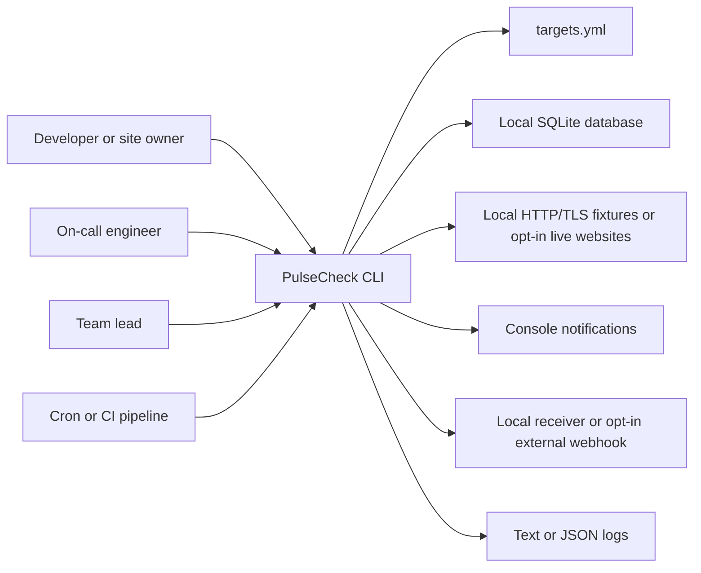
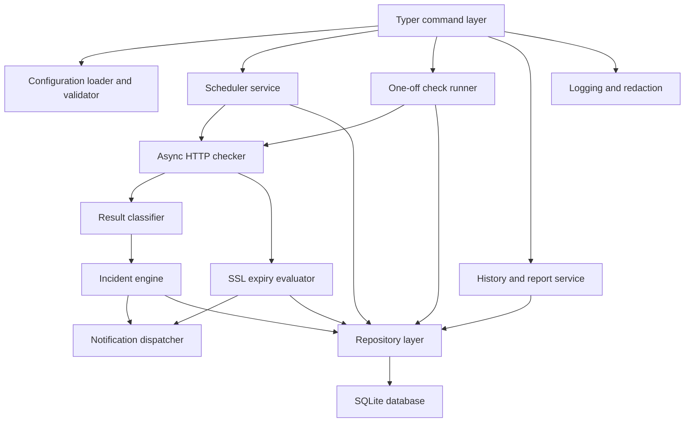
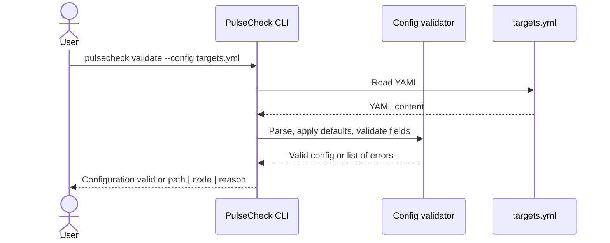
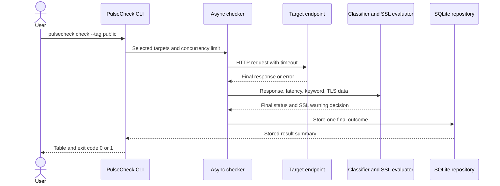
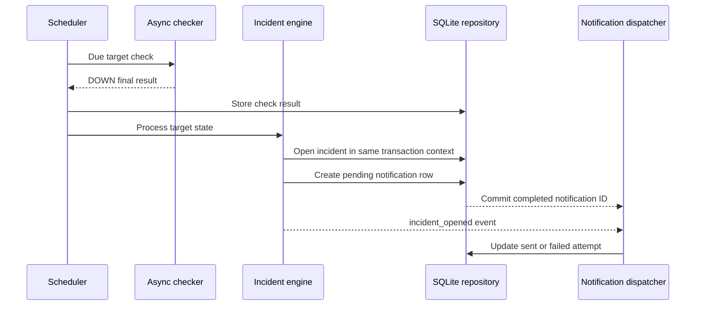
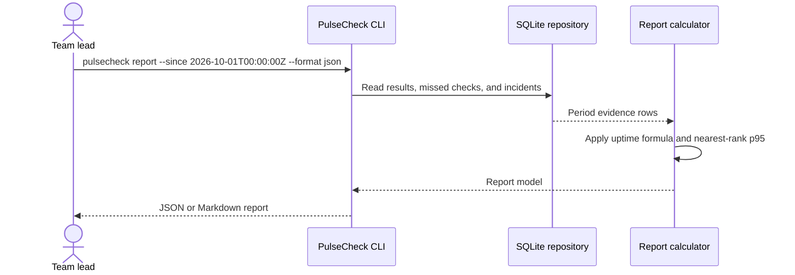
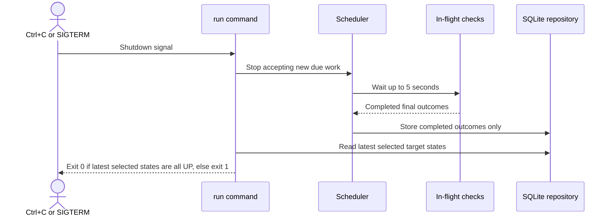

# PulseCheck system architecture

Purpose: This document describes the required architecture for PulseCheck. It shows the local CLI boundary, key runtime components, data flow, deployment profiles, implementation repository shape, and ADR topics.

## Architecture goals

PulseCheck is a local-first Python CLI. It checks HTTP and HTTPS targets, stores final evidence in SQLite, detects incidents, sends notifications, and produces reports. The architecture MUST keep pure decision logic separate from network, storage, and CLI code.

## System context



Context notes:

- `targets.yml` is the source of truth for configured targets.
- SQLite stores evidence, not configuration ownership.
- External webhooks are optional notification destinations.
- Cron and CI use documented exit codes for automation.
- Local training uses explicit fixture configuration, never a fallback after live failures. No frontend component exists.

## Component view



Component responsibilities:

| Component | Responsibility | Important requirement IDs |
|---|---|---|
| Typer command layer | Parse commands, options, formats, and exit codes. | FR-CLI-01 to FR-CLI-08 |
| Configuration loader and validator | Load YAML, apply defaults, and report all validation errors. | FR-CFG-01, FR-CFG-02, BR-01, BR-02 |
| Async HTTP checker | Run concurrent httpx checks with timeouts and retries. | FR-CHECK-01, FR-CHECK-02, NFR-PERF-01 |
| Result classifier | Produce `UP`, `DEGRADED`, or `DOWN` by exact rules. | FR-CHECK-03, BR-04 |
| Scheduler service | Run per-target schedules and record missed checks. | FR-SCHED-01, FR-SCHED-02 |
| Incident engine | Open and close incidents from final outcomes. | FR-INC-01, FR-INC-02 |
| SSL expiry evaluator | Check HTTPS certificate expiry and host match without blocking the event loop. | FR-SSL-01, FR-SSL-02 |
| Repository layer | Own SQLite migrations, transactions, reads, and purges. | FR-STORE-01, FR-STORE-02 |
| Notification dispatcher | Send console and webhook notifications with stable IDs. | FR-NOTIF-01, FR-NOTIF-02 |
| Reporter | Compute uptime, p95, incident count, missed checks, and MTTR. | FR-REPORT-01, FR-REPORT-02, FR-REPORT-03 |
| Logging and redaction | Emit useful text or JSON logs and hide secrets. | FR-OBS-01, NFR-SEC-02 |
| Local operation entrypoints | Start/stop fixtures and scheduler, migrate/seed SQLite, and prove offline persistence. | FR-LOCAL-01, BR-22 |

## Key sequences

### Validate a targets file



### Run a one-off check



### Scheduler opens an incident



### Report a period



### Graceful shutdown



## Data flow

1. The command layer reads `targets.yml` and validates it before any network work.
2. Effective target settings combine target overrides with global defaults.
3. The checker runs selected targets under the configured concurrency limit.
4. Retries happen inside one check. Only the final outcome moves forward.
5. The classifier labels the final outcome as `UP`, `DEGRADED`, or `DOWN`.
6. HTTPS targets also produce SSL observations and possible warning events.
7. The repository writes check results, incidents, and notifications with transactions.
8. The reporter reads stored evidence and computes metrics for a selected period.
9. The logger writes redacted text or JSON lines with correlation IDs.

## Local deployment view

PulseCheck MUST run without mandatory containers. Docker is a Should item for the student repository.

| Profile | Hardware | Required local services | Behaviour |
|---|---|---|---|
| Lite | 8 GB RAM, 4 CPU cores, 2 GB free disk | Python, uv, SQLite bind directory, HTTP/TLS/webhook fixtures | `make local-start`/`make local-stop`; 200-target performance gate requires recorded verification. |
| Standard | 16 GB RAM, 4 or more CPU cores, 5 GB free disk | Same plus optional Docker Compose | Should items can add local Mailpit; no frontend work. |

Windows WSL2 recommendations:

| Host RAM | `.wslconfig` memory | `.wslconfig` swap | Notes |
|---|---:|---:|---|
| 8 GB | 4GB | 4GB | Use the lite profile and avoid optional Compose during Must work. |
| 16 GB | 8GB | 4GB | Standard profile can run Mailpit and one local test target. |

Trainer pre-check: before week 1, the trainer MUST verify the proposed budgets and TC-LOCAL-001 through TC-LOCAL-004 on an 8 GB laptop. Document 06 owns ports 8765/8766/8767, certificate preparation, seed/demo, ignored `.local/` persistence, and reset confirmation; no app has been measured by this spec.

## Expected student repository tree

```text
pulsecheck/
  pyproject.toml
  uv.lock
  README.md
  CHANGELOG.md
  src/
    pulsecheck/
      __init__.py
      cli.py
      config/
      checks/
      incidents/
      notifications/
      reports/
      storage/
      logging_config.py
  tests/
    unit/
    integration/
    cli/
    performance/
    fixtures/
  docs/
    adr/
      ADR-001-record.md
  scripts/
  Makefile
  targets.local.yml
  .github/
    workflows/
  targets.example.yml
```

The specification does not require exact Python module names. The student MUST preserve the separation of concerns shown by this tree.

## Design principles

| Principle | Required application in PulseCheck |
|---|---|
| Local first | Must scope works with a local file, SQLite, and no cloud account. |
| Layered architecture | CLI, configuration, checking, pure logic, storage, and notifications remain separate. |
| Pure core logic | Classifier, incident engine, uptime calculator, p95 calculator, and SSL evaluator stay testable without network or SQLite. |
| Final-outcome storage | Retries do not create attempt rows. The final stored row includes `attempt_count`. |
| Fail closed | Invalid configuration stops before checks and exits 2. |
| At-least-once notification | External delivery uses stable IDs and de-duplication, not exactly-once promises. |
| Redaction by default | Secret headers, webhook tokens, and SMTP passwords never appear in logs or reports. |
| Portability | Must scope runs on WSL2 Ubuntu, macOS, and Linux with Python 3.12.x. |

## ADR topics the student MUST write

| ADR ID | Topic | Exact question to answer |
|---|---|---|
| ADR-001 | Async checker design | How will PulseCheck enforce concurrency, retries, timeout, and jitter without blocking other targets? |
| ADR-002 | Configuration validation | How will PulseCheck model the targets file and report all `path | code | reason` errors in one pass? |
| ADR-003 | SQLite repository layer | How will repository methods handle migrations, transactions, and query performance for 200 targets? |
| ADR-004 | Incident state machine | How will the incident engine store enough state to open after 3 DOWN results and close after 2 non-DOWN results? |
| ADR-005 | Notification de-duplication | How will stable `notification_id` and `dedupe_key` prevent duplicate external messages while keeping at-least-once delivery? |
| ADR-006 | SSL certificate evaluation | How will SSL expiry and hostname checks avoid blocking the asyncio event loop? |
| ADR-007 | Report calculations | How will the report service compute uptime, nearest-rank p95, missed checks, and MTTR consistently? |

[Back to README](../README.md)
