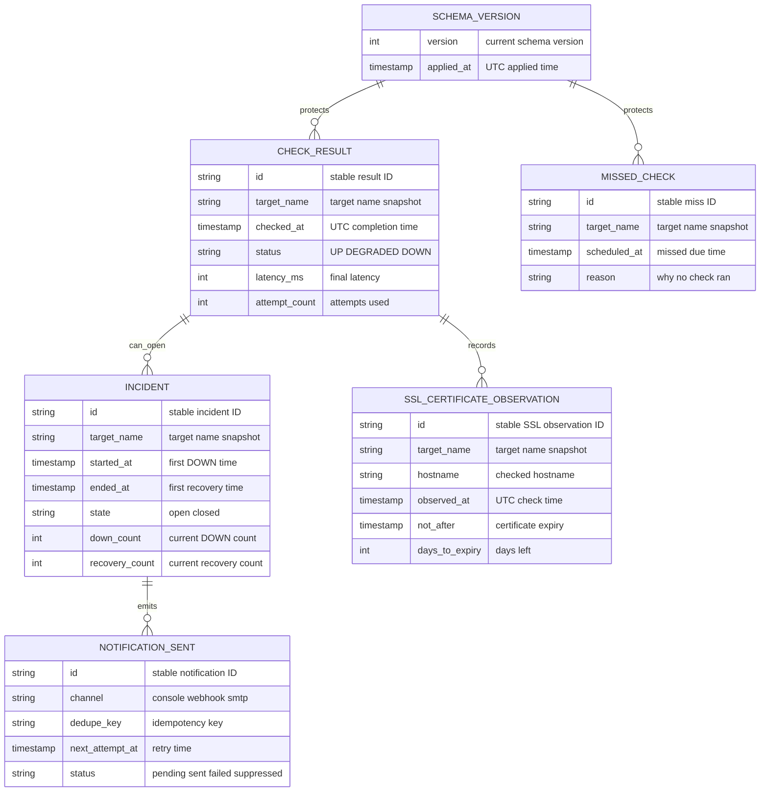

# PulseCheck data model

Purpose: This document defines the PulseCheck targets-file model, SQLite tables, relationships, constraints, sample data, retention, and migration policy.

## Data ownership summary

Targets live in the YAML targets file. SQLite MUST NOT be the source of truth for targets. SQLite stores monitoring evidence, missed checks, incidents, notification delivery records, SSL observations, and schema version.

## Entity relationship diagram

## Targets file logical model

The fields below are requirements for the YAML product interface. Document `08-cli-specification.md` contains the full example.

| Field | Logical type | Constraints | Default | Description |
|---|---|---|---|---|
| `global.concurrency` | integer | 1 to 200 | 10 | Maximum active network attempts. |
| `global.retries` | integer | 0 to 5 | 2 | Extra attempts after the first attempt. |
| `global.timeout_seconds` | decimal | 0.1 to 60.0 | 5.0 | Per-attempt HTTP timeout. |
| `global.interval_seconds` | integer | 10 to 86400 | 60 | Default scheduler interval. |
| `global.latency_threshold_ms` | integer | 1 to 60000 | 1500 | Default threshold for `DEGRADED`. |
| `global.incident_open_after_down` | integer | 1 to 10 | 3 | Consecutive `DOWN` results needed to open an incident. |
| `global.incident_close_after_recovered` | integer | 1 to 10 | 2 | Consecutive non-`DOWN` results needed to close an incident. |
| `global.notification_cooldown_minutes` | integer | 1 to 1440 | 30 | Reminder cooldown for same open incident. |
| `global.notification_channels` | list enum | `console`, `webhook`, `smtp` | `[console]` | Enabled notification channels. |
| `global.webhook_format` | enum | `generic`, `slack`, `discord` | `generic` | Webhook JSON body format. |
| `targets[].name` | string | Required unique slug; 1 to 64 chars | None | Stable target identifier used in storage. |
| `targets[].url` | string | Required `http` or `https` URL | None | Endpoint to check. |
| `targets[].method` | enum | Optional `GET` or `HEAD` | `GET` | HTTP method. |
| `targets[].expected_status_codes` | list integer | Optional non-empty; each 100 to 599 | `[200]` | Accepted HTTP statuses. |
| `targets[].keyword` | string | Optional; 1 to 200 chars; invalid with `HEAD` | None | Body text required for `GET`. |
| `targets[].timeout_seconds` | decimal | 0.1 to 60.0 | Global value | Target timeout override. |
| `targets[].interval_seconds` | integer | 10 to 86400 | Global value | Target interval override. |
| `targets[].latency_threshold_ms` | integer | 1 to 60000 | Global value | Target latency threshold override. |
| `targets[].tags` | list string | Optional non-empty strings | Empty list | Filter labels for `check --tag`. |
| `targets[].headers` | map string | Optional string key-value pairs | Empty map | Extra HTTP headers; secret values are redacted. |

## SQLite tables and columns

### `check_results`

| Column | Logical type | Constraints | Description |
|---|---|---|---|
| `id` | string | Primary result identifier; UUID format recommended | Stable result ID. |
| `target_name` | string | Required; indexed | Target name snapshot from YAML. |
| `url` | string | Required | URL snapshot from YAML. |
| `method` | enum | `GET` or `HEAD` | Method used for the check. |
| `checked_at` | timestamp | UTC; required; indexed | Completion time of the final attempt. |
| `status` | enum | `UP`, `DEGRADED`, or `DOWN`; indexed | Final classification. |
| `latency_ms` | integer | Null only when no response exists | Final attempt latency. |
| `attempt_count` | integer | 1 to 6 | Total attempts used. |
| `error_kind` | enum | Nullable | Failure category when status is `DOWN`. |
| `expected_status_codes` | string | Required | Comma-separated snapshot, such as `200,204`. |
| `actual_status_code` | integer | Nullable | HTTP status from final response. |
| `keyword_required` | string | Nullable | Keyword snapshot when configured. |
| `keyword_matched` | boolean | Nullable | Whether required keyword was present. |
| `correlation_id` | string | Required; indexed | ID used in logs. |

### `missed_checks`

| Column | Logical type | Constraints | Description |
|---|---|---|---|
| `id` | string | Primary missed-check identifier; UUID format recommended | Stable missed-check ID. |
| `target_name` | string | Required; indexed | Target name snapshot from YAML. |
| `scheduled_at` | timestamp | UTC; required; indexed | Due time that was missed. |
| `reason` | string | Required | Example: `previous_check_still_running`. |

### `incidents`

| Column | Logical type | Constraints | Description |
|---|---|---|---|
| `id` | string | Primary incident identifier; UUID format recommended | Stable incident ID. |
| `target_name` | string | Required; indexed | Target name snapshot. |
| `state` | enum | `open` or `closed`; indexed | Current incident state. |
| `started_at` | timestamp | UTC; required; indexed | Time of first `DOWN` in opening sequence. |
| `ended_at` | timestamp | UTC; nullable; indexed | Time of first non-`DOWN` in recovery sequence. |
| `opened_by_result_id` | string | Required | Check result that completed the opening sequence. |
| `closed_by_result_id` | string | Nullable | Check result that completed recovery. |
| `down_count` | integer | At least 0 | Current consecutive DOWN count. |
| `recovery_count` | integer | At least 0 | Current consecutive non-DOWN count. |
| `last_result_id` | string | Required | Latest result processed for this incident. |
| `created_at` | timestamp | UTC; required | Row creation time. |
| `updated_at` | timestamp | UTC; required | Last state update time. |

### `notifications_sent`

| Column | Logical type | Constraints | Description |
|---|---|---|---|
| `id` | string | Primary identifier; stable notification ID | Used for at-least-once delivery. |
| `event_type` | enum | Required | `incident_opened`, `incident_closed`, `incident_reminder`, or `ssl_expiry_warning`. |
| `channel` | enum | Required | `console`, `webhook`, or `smtp`. |
| `target_name` | string | Required; indexed | Related target. |
| `incident_id` | string | Nullable; indexed | Related incident when applicable. |
| `ssl_observation_id` | string | Nullable; indexed | Related SSL row when applicable. |
| `dedupe_key` | string | Required | Stable idempotency key. |
| `status` | enum | Required | `pending`, `sent`, `failed`, or `suppressed`. |
| `sent_at` | timestamp | UTC; nullable; indexed | Time of successful send. |
| `last_attempt_at` | timestamp | UTC; nullable | Latest delivery attempt time. |
| `next_attempt_at` | timestamp | UTC; nullable; indexed | Next retry time for `pending` or `failed` rows. |
| `attempt_count` | integer | At least 0 | Delivery attempts for this notification. |
| `failure_reason` | string | Nullable | Redacted error summary. |

### `ssl_certificate_observations`

| Column | Logical type | Constraints | Description |
|---|---|---|---|
| `id` | string | Primary SSL observation identifier; UUID format recommended | Stable observation ID. |
| `target_name` | string | Required; indexed | Target name snapshot. |
| `hostname` | string | Required; indexed | Hostname checked. |
| `port` | integer | 1 to 65535; default 443 | TLS port. |
| `observed_at` | timestamp | UTC; required; indexed | Observation time. |
| `not_before` | timestamp | Nullable | Certificate start time. |
| `not_after` | timestamp | Required | Certificate expiry time. |
| `days_to_expiry` | integer | Required; indexed | Whole 24-hour periods remaining, rounded down. |
| `hostname_match` | boolean | Required | Result of hostname validation. |
| `fingerprint_sha256` | string | Required; indexed | Certificate fingerprint. |
| `issuer` | string | Nullable | Should item for issuer output. |
| `subject` | string | Nullable | Should item for subject output. |
| `error_kind` | enum | Nullable | `tls`, `hostname`, or `internal`. |

### `schema_version`

| Column | Logical type | Constraints | Description |
|---|---|---|---|
| `id` | integer | Must be 1 for the current database | Single-row metadata key. |
| `version` | integer | Positive integer | Current schema version. |
| `applied_at` | timestamp | UTC; required | Time when the version was applied. |
| `description` | string | Required | Human-readable migration note. |

## Required indexes

| Table | Index requirement | Purpose |
|---|---|---|
| `check_results` | `target_name`, `checked_at` descending | Fast history and reports by target and period. |
| `check_results` | `status`, `checked_at` | Report counts by status. |
| `check_results` | `correlation_id` unique | Link logs to one stored result. |
| `missed_checks` | `target_name`, `scheduled_at` | Count scheduler misses by target and period. |
| `incidents` | `target_name`, `state`, `started_at` | Find open incident and period incidents. |
| `incidents` | `ended_at` | MTTR reports for closed incidents. |
| `incidents` | unique open incident per `target_name` | Enforce at most one open incident per target. |
| `notifications_sent` | unique `channel`, `dedupe_key` | De-duplicate at-least-once delivery. |
| `notifications_sent` | `incident_id`, `event_type`, `sent_at` | Cooldown and incident audit. |
| `notifications_sent` | `status`, `next_attempt_at` | Find pending notification retries while `run` operates. |
| `ssl_certificate_observations` | `target_name`, `observed_at` | Latest SSL status lookup. |
| `ssl_certificate_observations` | `fingerprint_sha256` | Lookup observations for a certificate. |
| `schema_version` | unique `id` | Keep one current version row. |

## Required constraints

- `check_results.status` MUST be one of `UP`, `DEGRADED`, or `DOWN`.
- `check_results.attempt_count` MUST be from 1 to 6.
- `incidents.state` MUST be `open` or `closed`.
- At most one open incident MUST exist for one `target_name`.
- `incidents.ended_at` MUST be null when state is `open`.
- `incidents.ended_at` MUST be greater than or equal to `started_at` when state is `closed`.
- `notifications_sent.channel` plus `dedupe_key` MUST be unique.
- `notifications_sent.status` MUST allow `pending`, `sent`, `failed`, and `suppressed`.
- SSL warning de-duplication MUST use `notifications_sent.dedupe_key` with hostname, certificate fingerprint, and threshold.
- `schema_version` MUST contain exactly one current row after initialization.
- Repository writes that update check result plus incident state MUST use one transaction.

## Enumerations

| Enum | Values |
|---|---|
| `http_method` | `GET`, `HEAD` |
| `result_status` | `UP`, `DEGRADED`, `DOWN`, `UNKNOWN` for display only |
| `error_kind` | `connection`, `dns`, `tls`, `timeout`, `status`, `keyword`, `hostname`, `internal` |
| `incident_state` | `open`, `closed` |
| `notification_event_type` | `incident_opened`, `incident_closed`, `incident_reminder`, `ssl_expiry_warning` |
| `notification_channel` | `console`, `webhook`, `smtp` |
| `notification_status` | `pending`, `sent`, `failed`, `suppressed` |
| `webhook_format` | `generic`, `slack`, `discord` |
| `output_format` | `table`, `json`, `markdown`, `csv` (Should) |

## Sample rows

### `check_results`

| id | target_name | checked_at | status | latency_ms | attempt_count | error_kind |
|---|---|---|---|---:|---:|---|
| `11111111-1111-4111-8111-111111111111` | `college-home` | `2026-10-02T09:30:00Z` | `UP` | 120 | 1 | null |
| `22222222-2222-4222-8222-222222222222` | `fee-portal` | `2026-10-02T09:31:00Z` | `DEGRADED` | 1800 | 1 | null |
| `33333333-3333-4333-8333-333333333333` | `api-health` | `2026-10-02T09:32:00Z` | `DOWN` | null | 3 | `timeout` |

### `missed_checks`

| id | target_name | scheduled_at | reason |
|---|---|---|---|
| `88888888-8888-4888-8888-888888888888` | `slow-api` | `2026-10-02T09:40:00Z` | `previous_check_still_running` |

### `incidents`

| id | target_name | state | started_at | ended_at | down_count | recovery_count |
|---|---|---|---|---|---:|---:|
| `44444444-4444-4444-8444-444444444444` | `api-health` | `open` | `2026-10-02T09:30:00Z` | null | 3 | 0 |
| `55555555-5555-4555-8555-555555555555` | `fee-portal` | `closed` | `2026-10-01T10:00:00Z` | `2026-10-01T10:20:00Z` | 3 | 2 |

### `notifications_sent`

| id | event_type | channel | target_name | dedupe_key | status | sent_at |
|---|---|---|---|---|---|---|
| `66666666-6666-4666-8666-666666666666` | `incident_opened` | `webhook` | `api-health` | `incident:44444444-4444-4444-8444-444444444444:opened` | `sent` | `2026-10-02T09:32:05Z` |
| `77777777-7777-4777-8777-777777777777` | `ssl_expiry_warning` | `console` | `college-home` | `ssl:www.example.in:abc123:30` | `sent` | `2026-10-02T09:33:00Z` |
| `99999999-9999-4999-8999-999999999999` | `incident_closed` | `webhook` | `fee-portal` | `incident:55555555-5555-4555-8555-555555555555:closed` | `pending` | null |

## Retention policy

`purge --older-than <days>` MUST delete `check_results` and `ssl_certificate_observations` older than the cutoff. It MUST NOT delete open incidents. It MAY delete closed incidents and related notification rows only when their `ended_at` and `sent_at` values are older than the cutoff and no open incident references them.

It MUST delete `missed_checks` by `scheduled_at`. Missed checks are not check results, so they never affect status or incidents.

Purge output MUST report row counts for `check_results`, `missed_checks`, `ssl_certificate_observations`, `incidents`, and `notifications_sent`. The command MUST reject values below 1 day.

## Migration policy

Schema versioning MUST use the `schema_version` table. Each schema change MUST have a migration note in the student CHANGELOG. Migrations MUST be idempotent and safe to run once during startup.

If migration fails, PulseCheck MUST stop the command, print `Internal error: database migration failed`, and exit 3. The tool MUST NOT silently delete or recreate a user's database.

## Local seed and persistence

FR-LOCAL-01 uses ignored `.local/pulsecheck.db` for runtime evidence and `.local/demo.db` for the fixed five-result fictional seed in document 06. Apply the same migrations to both before seeding/reading; initialize the demo once through repository/incident logic with recorded timestamps. The seed contains 5 final checks, 1 closed incident with duration 180 seconds, and 2 sent console notifications. Normal live checks never substitute these rows for a failed request.

Stop/start MUST retain stable check/incident/notification IDs, pending/failed outbox state, cooldown keys, and SSL threshold keys. A reset deletes only project-local data after explicit confirmation while stopped. Optional replay requires a fresh isolated database and leaves runtime/demo data unchanged. Tag-group report statistics use tags from the current selected YAML file, not a new target table or a historical tag claim.

[Back to README](../README.md)
