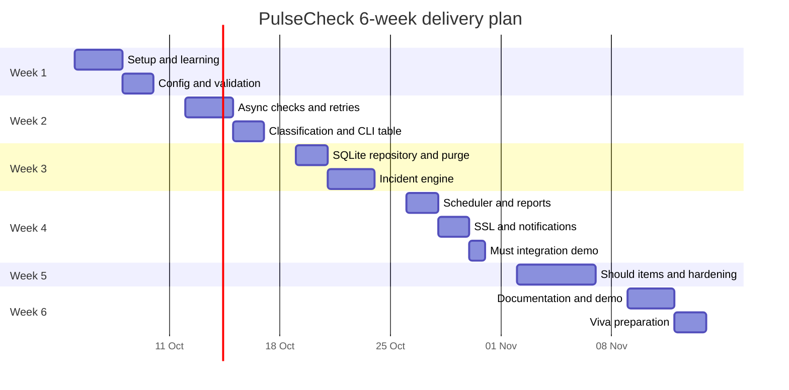

# PulseCheck milestones and deliverables

Purpose: This document gives the 6-week plan, effort budget, Gantt view, deliverables, submission process, and final demo script.

## Effort budget

The plan uses about 178 hours. Must work is 118 hours, including 30 hours of learning and setup. No week plans more than 30 hours.

| Feature area | Priority | Hours | Main IDs |
|---|---|---:|---|
| Guided setup and Python CLI learning | Must | 30 | FR-PKG-01, FR-OBS-01 |
| Targets file and validation | Must | 12 | FR-CFG-01, FR-CFG-02, FR-CLI-01, FR-CLI-02 |
| One-off async checks and classification | Must | 16 | FR-CLI-03, FR-CHECK-01, FR-CHECK-02, FR-CHECK-03 |
| Scheduler and graceful shutdown | Must | 12 | FR-CLI-04, FR-SCHED-01, FR-SCHED-02 |
| SQLite repository and purge | Must | 12 | FR-STORE-01, FR-STORE-02 |
| Incidents, uptime, p95, and MTTR | Must | 12 | FR-INC-01, FR-INC-02, FR-CLI-07 |
| SSL checks and expiry warnings | Must | 9 | FR-SSL-01, FR-SSL-02 |
| Notifications and cooldown | Must | 8 | FR-NOTIF-01, FR-NOTIF-02 |
| Status, history, reports, logs, packaging | Must | 7 | FR-CLI-05, FR-CLI-06, FR-REPORT-01, FR-OBS-01, FR-PKG-01 |
| SMTP, CSV, HTML, Docker, MkDocs, TestPyPI | Should | 30 | FR-NOTIF-03, FR-REPORT-04, FR-REPORT-05, FR-OPS-01, FR-DOC-01 |
| Hardening, test gaps, demo, viva | Should | 22 | NFR-TEST-01, NFR-SEC-03, NFR-DOC-01 |
| Shared stretch and contingency | Could | 8 | FR-UI-01, FR-MET-01, FR-CHECK-04, FR-NOTIF-04, FR-TEST-01 |

## Week-by-week plan

| Week | Goals | Tasks with IDs | Deliverables | Friday demo checkpoint |
|---|---|---|---|---|
| 1 | Build the foundation and first vertical slice. | Spend 24 hours on guided setup and CLI learning. Spend 6 hours on config basics for FR-CFG-01 and FR-CLI-01. | Public `pulsecheck` repo, Projects board, README setup draft, sample targets file, first validation tests. | Show invalid `method: HEAD` plus `keyword` returning exit code 2. |
| 2 | Complete config and one-off checking. | Spend 6 hours on remaining learning, 6 hours on validation for FR-CFG-02 and FR-CLI-02, and 16 hours on checks for FR-CLI-03, FR-CHECK-01, FR-CHECK-02, FR-CHECK-03. | `check` command, local HTTP tests, result table, exit code tests. | Show one `UP`, one `DEGRADED`, and one `DOWN` target in one run. |
| 3 | Add storage, reports, and command coverage. | Spend 12 hours on storage and purge, 12 hours on incident and report logic, and 6 hours on `status`, `history`, `report`, logs, and packaging. | SQLite tables, repository tests, purge command, incident state tests, first report output. | Show three `DOWN` results opening an incident and purge preserving it. |
| 4 | Finish Must runtime behaviour. | Spend 12 hours on scheduler and shutdown, 9 hours on SSL, 8 hours on notifications, and 1 hour on final CLI integration. | All Must commands, coverage gates, security scans, performance test. | Show scheduler, incident close after two non-DOWN results, SSL 14-day warning, and weekly report. |
| 5 | Add Should items and harden. | Spend up to 18 hours on Should items and 12 hours on hardening after Must is green. | Mailpit demo, static status page, Docker run notes, docs site draft. | Show one Should feature and explain what remained out of scope. |
| 6 | Polish portfolio and prepare viva. | Spend 12 hours on remaining Should items, 10 hours on hardening and demo, and up to 8 hours on Could stretch or contingency. | Final repository, coverage report, ADRs, CHANGELOG, 5-minute video, final demo script. | Run the final 10-minute demo and answer viva questions. |

## Gantt chart

## Final deliverables checklist

- Public GitHub repository named `pulsecheck`.
- Trainer `@sukurcf` added as collaborator.
- README with clean-clone setup in 10 steps or fewer.
- Architecture diagram and at least 5 ADRs in the student repository.
- Working commands: `init`, `validate`, `check`, `run`, `status`, `history`, `report`, and `purge`.
- Tests for at least 45 concrete cases.
- Coverage report showing at least 90% line and 80% branch coverage.
- 100% branch coverage evidence for pure-logic modules.
- CI green on `main` for Python 3.12 and 3.13 on Ubuntu and Windows.
- Security scan evidence for pip-audit and Gitleaks.
- Performance evidence for 200 targets under 10 seconds.
- CHANGELOG with SemVer entries.
- Demo video of maximum 5 minutes.
- Optional Should evidence, if implemented.
- Optional Could evidence, if claimed for bonus.

## Submission process

1. Freeze new feature work 24 hours before the final demo.
2. Run the full CI pipeline on `main`.
3. Export or screenshot the coverage summary.
4. Record the 5-minute video from a clean terminal.
5. Open a GitHub Issue titled `[Submission] PulseCheck final submission` in the specification repository.
6. Add links to the repository, final commit, CI run, coverage evidence, and video.
7. List claimed Could bonus items.
8. Be ready to change one small part live during the viva.

## Ten-minute final demo script

| Minute | What to show |
|---:|---|
| 0 | State the problem: local uptime, SSL warnings, incidents, and reports for small teams. |
| 1 | Show the repository, README setup, CI badge, and branch history. |
| 2 | Run `pulsecheck validate` on a valid targets file and one invalid file. |
| 3 | Run `pulsecheck check` with `UP`, `DEGRADED`, and `DOWN` outputs. |
| 4 | Show retry count, exact exit code 1, and a stored SQLite result through `history`. |
| 5 | Run or replay scheduler evidence that opens an incident after 3 `DOWN` results. |
| 6 | Show recovery after 2 non-`DOWN` results and explain MTTR. |
| 7 | Show an SSL expiry warning at 14 days and explain hostname match. |
| 8 | Run `report` and explain uptime formula, p95 nearest-rank, missed checks, and MTTR. |
| 9 | Show tests, coverage gates, mypy strict, Ruff, pip-audit, Gitleaks, and one ADR. |
| 10 | Answer one viva question and state one improvement you would do next. |

[Back to README](../README.md)
